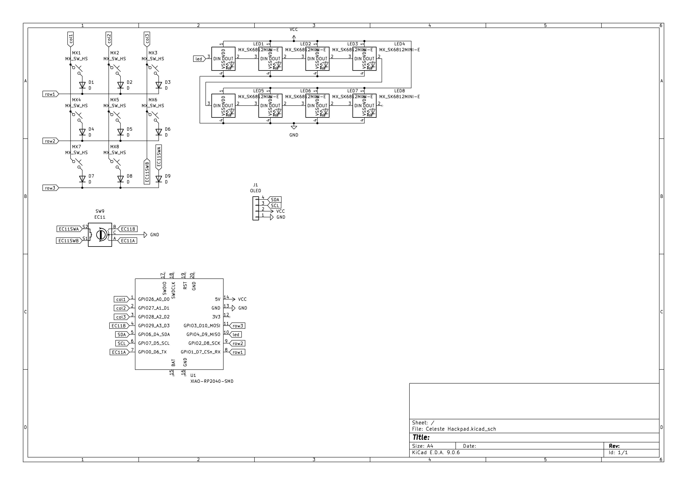
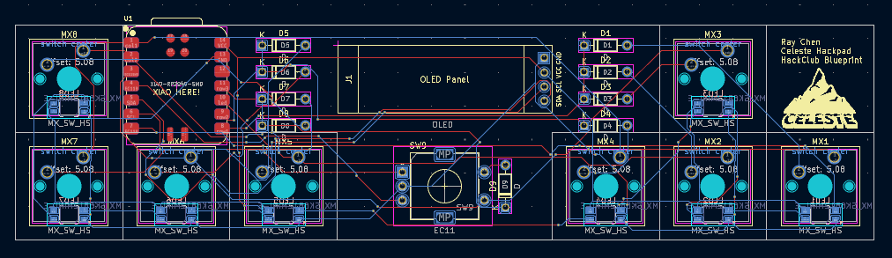
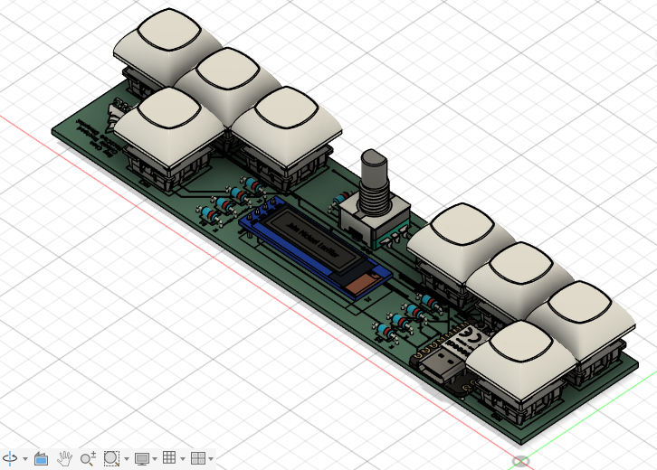
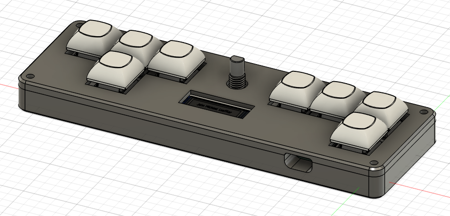

# Celeste Hackpad
8-key macropad with ZXC, Esc, arrow keys. Features LEDs, OLED and rotary encoder.

## Schematic

## PCB

## CAD assembly

## BOM
- 8x Cherry MX Switches
- 8x DSA Keycaps
- 9x Through-hole 1N4148 DO-35 Diodes
- 8x SK6812 MINI-E LEDs
- 1x 0.91" 128x32 OLED Display
- 1x EC11 Rotary Encoder
- 1x XIAO RP2040
- 1x Case

## Controls
To aid speedrunning Celeste, many key chords have been implemented.
- Esc + Down arrow: F (bound to menu down and menu confirm)
- Arrow keys + Esc: S (bound to crouch dash)
- C + Up arrow: D (bound to second jump button)
- Esc + Up arrow: Toggle LEDs
